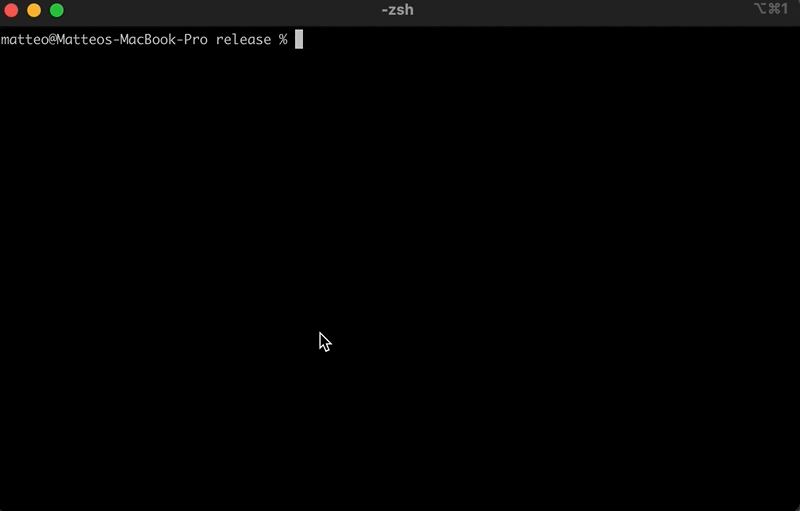
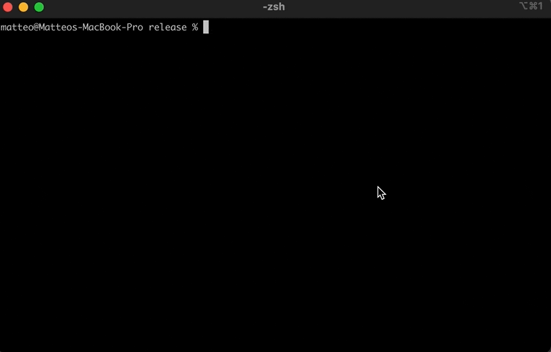

=

### 🦐 Command-line interface (CLI) for Kraken exchange WebSockets API | Written in Rust

# Description

**```gambero```** executable offers I/O interop with the [Kraken exchange WebSockets API](https://support.kraken.com/hc/en-us/sections/360003493672-WebSocket-API).

**NOTE**: this is a compound tool built on top of [squalo](https://crates.io/crates/squalo) and [polipo](https://crates.io/crates/polipo) libraries. Have a look at them if you need detached and/or more application-specific integration capabilities.

# Prerequisites

The [Kraken exchange](https://kraken.com) allows **```WebSockets API```** interaction with both **```public```** and **```private```** data.

Only for the **```private```** one, you need to issue an **```API-Key```** and an **```API-Secret```** to the **```gambero```** executable, in order to [generate authentication token](https://www.kraken.com/features/api#ws-auth) for signed subscriptions on **```WebSockets```** endpoints.

If you are not familiar with, please have a look at [WebSockets API - FAQ](https://support.kraken.com/hc/en-us/articles/360022326871-Kraken-WebSocket-API-Frequently-Asked-Questions#1) for a general overview, or at [WebSockets API](https://docs.kraken.com/websockets/) document.

# Installation

By supposing that there's [cargo](https://doc.rust-lang.org/cargo/) installed on your system, just spawn a **```console```** and run:

```console
cargo install gambero
```

# Usage

For Kraken **```public API```** interaction, run:

```console
gambero public
```

For Kraken **```private API```** interaction, run:

```console
gambero private <kraken_api_key> <kraken_api_secret>
```

# Input/Output

A spawned **```gambero```** instance utilizes both **```stdin```** and **```stdout```** as **data streams**.

The **```crate information```** and the **```usage instructions```** printed out at the very beginning of the execution, comes in **```plain text```**.

For any incoming/outgoing data, stringified **```JSON```** format is used/expected.

It's up to you to submit/parse payloads accordingly to their shapes.

**NOTE**: only for the **```private```** stream, if both the **```API Key```** and the **```API Secret```** have been correctly issued, an **```authentication token```** will be returned in the compact form as follow:

```json
{"token":"5t+vlXHPfRfb660YUiIeA0m9PESCKpJqO0bH8G+OjMw"}
```

and it can be used in the envelop of any further message that need it explicitly.

# Examples

**Public stream**



**Private stream**



# Disclaimer

This software comes without any kind of warranties.

I will not be liable for any damages related to the use or the misuse of this software.

You are the sole responsible.
